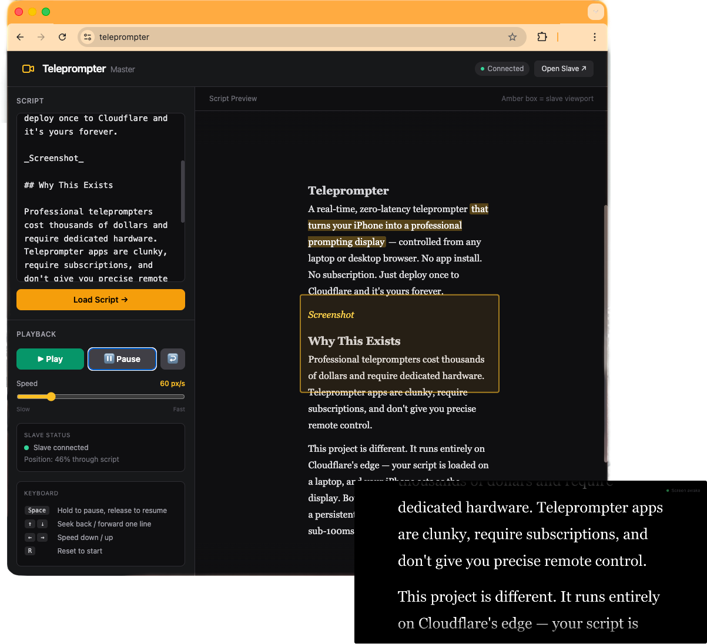

# 📺 Teleprompter

A real-time, zero-latency teleprompter that turns any phone or tablet into a professional prompting display — controlled from any laptop or desktop browser. No app install. No subscription. Just deploy once to Cloudflare and it's yours forever.



---

## 🌐 Demo

A live demo is available at **[https://teleprompter.ali.cam/](https://teleprompter.ali.cam/)** — no sign-up or install required. Open it on your laptop to use as the controller, then scan the QR code on your phone to connect the display.

---

## ✨ Why This Exists

Professional teleprompters cost many hundreds of dollars and require dedicated hardware. Teleprompter apps are clunky, require subscriptions, and don't give you precise remote control.

This project is different. It runs entirely on **Cloudflare's edge** — your script is loaded on a laptop, and your phone acts as the display. Both sides stay in perfect sync over a persistent WebSocket connection, with sub-100ms latency anywhere in the world.

---

## 🏗️ Architecture

The magic is powered by two Cloudflare primitives:

```
┌────────────────────────┐      WebSocket (WSS)      ┌────────────────────────┐
│  Controller (Laptop)   │ ◄───────────────────────► │  Cloudflare Worker     │
│  yourdomain.com/{hash} │                           │  + Durable Object      │
└────────────────────────┘                           │  (TeleprompterSession) │
                                                     └──────────┬─────────────┘
┌────────────────────────────────┐      WebSocket (WSS)         │
│  Display (Phone/Tab)           │ ◄────────────────────────────┘
│  yourdomain.com/{hash}/display │
└────────────────────────────────┘
```

- **[Cloudflare Workers](https://workers.cloudflare.com/)** — serves the static UI, handles WebSocket upgrades, and manages session routing at the edge, globally.
- **[Durable Objects](https://developers.cloudflare.com/durable-objects/)** — each session hash maps to its own `TeleprompterSession` instance via `idFromName(hash)`. The DO holds authoritative state (script, playback, speed, scroll position) and brokers messages between the controller and display clients in real time. **No two users can interfere with each other's sessions.**
- **Static Assets** — HTML, JS, and CSS are served directly from the Worker using the `ASSETS` binding — no separate CDN needed.

There is **no database**, **no server to manage**, and **no cold starts**. The Durable Object keeps the session alive as long as clients are connected.

---

## 🔐 Multi-User Session Isolation

Every visitor gets a **private, persistent session** identified by an 8-character hex hash in the URL:

```
yourdomain.com/f4d0041a          → your controller (laptop/desktop)
yourdomain.com/f4d0041a/display  → your display (phone/tablet)
```

**How the session hash is assigned:**

1. First visit to `yourdomain.com/` — the controller page loads and `controller.js` generates a random 8-char hex hash, stores it in **`localStorage`** under the key `tp_session`, then updates the URL to `yourdomain.com/f4d0041a` via `history.replaceState`.
2. Every subsequent visit to `yourdomain.com/` — the page loads, `controller.js` reads `localStorage`, and immediately restores the same hash and URL. Your session is stable across days, weeks, and months.

`localStorage` is used instead of a server-set cookie because cookies on HTTP redirect responses can be stripped by Cloudflare's edge cache, and are blocked by Safari ITP and Firefox strict-mode privacy settings. `localStorage` persists indefinitely until the user explicitly clears site data, and is strictly same-origin.

**Why this matters for the PWA workflow:**
- First visit → scan the QR code on the controller → phone navigates to `yourdomain.com/f4d0041a/display`
- Save that URL to the home screen as a PWA (for true full-screen on iOS)
- Come back a month later: visit `yourdomain.com/` on your laptop → `localStorage` restores `f4d0041a` → phone PWA still points at `yourdomain.com/f4d0041a/display` → **everything just works, no re-pairing needed**

---

## 🚀 Features

### Controller (Laptop / Desktop)
- **Session QR code** — the sidebar shows a live QR code encoding your display URL; scan it on the phone to connect instantly, no URL typing needed
- **Session code** — the 8-char hash is shown in readable `F4D0 041A` format alongside a **Copy link** button for sharing
- **Script editor** — paste or type your script with full Markdown support
- **Live preview** — rendered script mirrors exactly what the display shows
- **Amber keyline overlay** — a live bounding box on the preview shows precisely which lines are currently visible on the display screen
- **Play / Pause / Reset** — one-click playback control
- **Variable speed** — smooth 5–300 px/s range with a live slider
- **Display position tracking** — see exactly how far through the script the reader is (% progress)
- **Robust reconnection** — a heartbeat ping/pong detects dead connections and reconnects automatically; controls are disabled while disconnected so clicks never vanish silently
- **Keyboard shortcuts** for hands-free control:

| Key | Action |
|---|---|
| `Space` (hold) | Push-to-pause — hold to pause, release to resume |
| `↑` / `↓` | Seek back / forward one line |
| `←` / `→` | Speed down / up |
| `R` | Reset to start |

### Display (Phone / Tablet)
- **QR-connected** — scanning the controller QR code navigates directly to the right session URL; save it as a home screen PWA for persistent full-screen access
- **Auto-detected** — Android and iOS devices visiting `yourdomain.com/{hash}` (the controller URL, e.g. from a shared link) are automatically redirected to the display view
- **Full-screen black display** — high-contrast white text on black, optimised for on-camera reading
- **Large, responsive text** — fluid font sizing from 1.5rem to 2.25rem based on screen width
- **Screen wake lock** — keeps the display on while prompting using the native Wake Lock API (Chrome 84+, Safari 16.4+, Firefox 126+), with a NoSleep.js video-loop fallback for older browsers
- **Smooth scrolling engine** — float-precision scroll accumulator avoids the sub-pixel stalling that affects slow scroll speeds on some mobile browsers
- **Fullscreen mode** — one-tap fullscreen via the Fullscreen API, with platform-appropriate "Add to Home Screen" instructions as a fallback on browsers that restrict it
- **Auto-reconnect** — if the connection drops, the display reconnects silently and picks up where it left off

### Both
- **Markdown formatting** — enrich your script with structure:
  - `**bold**` → bright white emphasis
  - `*italic*` → golden yellow cue
  - `==highlight==` → amber highlight block
  - `# H1`, `## H2`, `### H3` → visual section breaks
  - `` `code` `` → red monospace (great for phonetic cues)
- **Real-time sync** — all state (script, play/pause, speed, scroll position) is synchronised instantly via WebSocket
- **Zero install** — runs in any modern browser, no app required

---

## 📋 Requirements

- A [Cloudflare account](https://dash.cloudflare.com/sign-up) (free tier is sufficient)
- [Node.js](https://nodejs.org/) (v18+)
- [Wrangler CLI](https://developers.cloudflare.com/workers/wrangler/) (installed via `npm install`)

---

## 🛠️ Deploying

```bash
# 1. Clone the repo
git clone https://github.com/alicam/teleprompter.git
cd teleprompter

# 2. Install dependencies
npm install

# 3. Authenticate with Cloudflare
npx wrangler login

# 4. Deploy
npx wrangler deploy
```

Wrangler will print your Worker URL (e.g. `https://teleprompter.yourname.workers.dev`).

---

## 🎬 Using It

### First-time setup

1. **Open `yourdomain.com` on your laptop** — the controller page loads, generates your session hash, stores it in `localStorage`, and updates the URL to `yourdomain.com/f4d0041a`
2. **Scan the QR code** shown in the sidebar on your phone — it navigates to `yourdomain.com/f4d0041a/display`
3. On the phone, tap **Begin Prompting** (this acquires the wake lock and connects the WebSocket)
4. **Save the display to your home screen** for a permanently full-screen PWA:
   - **iOS Safari:** tap **Share → Add to Home Screen**
   - **Android Chrome:** tap **⋮ menu → Add to Home Screen**
5. On the laptop, paste your script and click **Load Script →**
6. Hit **▶ Play** and start reading

### Every subsequent session

- Visit `yourdomain.com` on your laptop → `localStorage` restores `f4d0041a` → URL updates to `yourdomain.com/f4d0041a` instantly → same QR code, same session
- Open the home screen PWA on your phone → same display URL → connects to the same session automatically

> **No re-pairing, no QR scanning, no code entry** — `localStorage` and the saved PWA stay in sync indefinitely.

---

## 🗂️ Project Structure

```
teleprompter/
├── src/
│   └── worker.js          # Cloudflare Worker + Durable Object (routing, sessions, real-time state)
├── public/
│   ├── index.html         # Controller UI (laptop/desktop)
│   ├── controller.js      # Controller logic — session, QR code, WebSocket, playback, keyline
│   ├── display.html       # Display UI (phone/tablet)
│   ├── display.js         # Display logic — session, scroll engine, wake lock, fullscreen
│   ├── md.js              # Lightweight Markdown parser (no dependencies)
│   └── nosleep.js         # Screen wake lock fallback (silent video loop)
└── wrangler.toml          # Cloudflare deployment config
```

---

## ⚙️ How the WebSocket Protocol Works

The server acts as a simple message broker. Controllers send commands; displays execute them and report back their scroll position. Each session's WebSocket endpoint is at `/{hash}/ws`.

```
Controller                   Server (Durable Object)                Display
    │                                 │                               │
    │── setScript ───────────────────►│── scriptUpdate ──────────────►│
    │── play ────────────────────────►│── command: play ─────────────►│
    │                                 │◄──── scrollUpdate ────────────│
    │◄── displayPosition ─────────────│                               │
    │── pause ───────────────────────►│── command: pause ────────────►│
    │── ping ────────────────────────►│── pong ───────────────────────│ (heartbeat)
```

See the top of `src/worker.js` for the full message type reference.

---

## 🔧 Customisation Ideas

- **Font / colour themes** — edit the CSS variables in `display.html` and `index.html`
- **Mirror mode** — add a CSS `scaleX(-1)` transform to `#script-text` for use with a physical beam-splitter rig
- **Speed presets** — add preset buttons (Slow / Medium / Fast) that snap the slider to common values

---

## 📄 License

MIT — do whatever you like with it.
